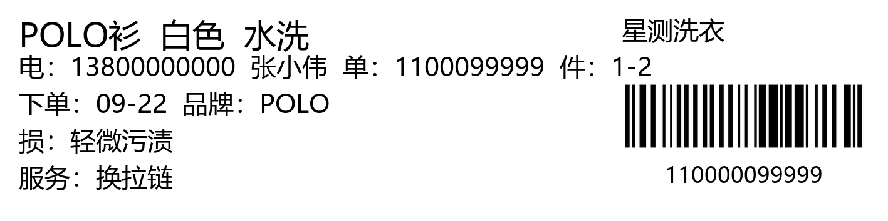
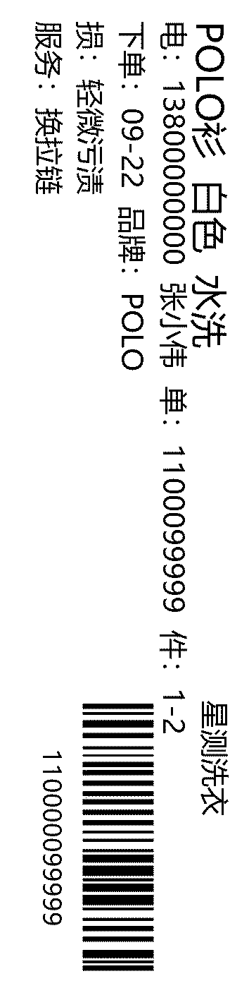

# 水洗唛打印助手（Print Converter）

洗衣管家打印出来的水洗唛是 120×30mm 横版内容，而门店标签机（佳博 GP-9134T）按 30×120mm 竖版出纸。
本工具在后台自动完成：**捕获打印 → 旋转 90° → 送印 → 归档**，不再需要手动转 PDF。

> 版本 v1.0（2026-09-22）· 更新记录见 [CHANGELOG.md](CHANGELOG.md)

## 运行环境

- Windows 10 / 11 + Python 3.10+（本机为 3.14）；依赖安装：`pip install -r requirements.txt`
- 打印链路需就绪：pdfFactory「水洗唛转换」打印机（已开启自动保存）+ 佳博 GP-9134T「水洗唛」打印机

## 效果示例





## 日常使用（三步）

1. 双击 **`启动监视.cmd`**（保持窗口开着；关掉窗口 = 停止监视），或双击 `打开控制面板.cmd` 用面板控制；
2. 照旧打印水洗唛（打印时选择「水洗唛转换」）；
3. 其余全自动：自动旋转、自动打印到「水洗唛」、自动归档留底。

## 首次使用建议

- 先打印一张真实水洗唛试跑，核对方向与位置；如需对比，双击 `打印校准唛.cmd` 会打出两版（顺时针/逆时针）各一张，选与日常一致的那版（详见说明书第 4 节）。
- 需要开机自动运行：右键 **`安装开机自启.ps1`** → 使用 PowerShell 运行（如提示权限不足，用管理员身份运行）。

## 标签内容编辑器（初版）

需要临时修改或自制标签内容时，双击 **`打开标签编辑器.cmd`**：自动识别最近一次打印数据中的字段（单号、客户、衣物名称、颜色、件数、品牌等），逐项修改后即可预览、另存或直接打印到标签机。

## 目录说明

| 目录 / 文件 | 说明 |
|---|---|
| `app\` | 程序代码（watcher.py 监视引擎、cli.py 命令行、ui.py 控制面板） |
| `out\archive\` | 每次打印自动归档的 PDF 原件（补打用；运行时自动创建） |
| `out\previews\` | 处理后的标签位图（预览核对用） |
| `out\logs\` | 运行日志（排查问题先看这里） |
| `config.json` | 运行配置（旋转方向、偏移、监视目录等） |
| `inbox\` | 手动投递目录：把 PDF 放进来会被自动处理 |
| `启动监视.cmd` / `停止监视.cmd` | 启停后台监视 |
| `打开控制面板.cmd` | 图形控制面板 |
| `打印校准唛.cmd` / `把PDF拖到这里处理.cmd` | 校准 / 手动处理单个 PDF |
| `打开标签编辑器.cmd` | 标签内容编辑器（识别 → 编辑 → 预览 → 打印） |
| `安装开机自启.ps1` / `卸载开机自启.ps1` | 开机自启的安装与卸载 |
| `docs_build\` | 《使用说明与交付报告.docx》生成脚本（备用，日常不需要） |
| `开发工具\` | 可选开发脚本：版面实验室与链路自测 |
| `文档素材\` | 示例图片（见上方「效果示例」） |

详细使用说明见 **《使用说明与交付报告.docx》** 或 **《使用说明.html》**。

## 命令行（进阶）

```
python -m app.cli watch            # 常驻监视
python -m app.cli once 文件.pdf    # 处理单个文件（--dry-run 只预览不打印）
python -m app.cli calibrate        # 打印两版校准唛
python -m app.cli printers         # 打印机与分辨率信息
python -m app.cli recognize 文件.pdf           # 识别标签字段（JSON 输出）
python -m app.cli custom                       # 打开标签内容编辑器
python -m app.cli label --json '{...}' --print # 渲染/打印自定义标签
```

## 技术要点

- 捕获来源：pdfFactory「水洗唛转换」打印机的自动保存目录（静默落盘，无需手动保存）；
- 输出：佳博 GP-9134T，「水洗唛」打印机，30×120mm @ 300dpi 单色位图（GDI 直打）；
- 安全闸：非标签尺寸（比例/大小不符）的 PDF 不会被打印，会移入 `out\hold\` 待人工确认；
- 合规：不修改洗衣管家本体及其数据；仅使用打印链路与 pdfFactory 的自动保存设置。
